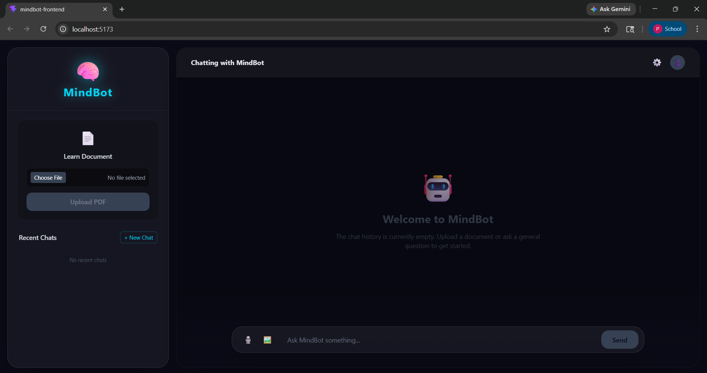

# 🤖 MindBot – Conversational AI System

## 📌 Overview

MindBot is an AI-powered conversational assistant designed to interact with users through multiple modalities such as text, voice, and documents. The system leverages modern Natural Language Processing (NLP) techniques and Retrieval-Augmented Generation (RAG) to deliver accurate, context-aware responses.

This project demonstrates the integration of full-stack development with AI/ML concepts, making it a practical implementation of intelligent systems.

---

## 🖼️ Project Preview



---

## 🎯 Objectives

* Build an intelligent chatbot capable of understanding user queries
* Implement document-based question answering using RAG
* Integrate speech-to-text and vision-based capabilities
* Develop a scalable full-stack AI application

---

## 🧠 Key Features

* 💬 **Conversational Chatbot** – Real-time interaction using LLM
* 📄 **Document Analysis (RAG Pipeline)** – Upload PDFs and query content
* 🎤 **Voice Input Support** – Convert speech to text using Whisper
* 🖼️ **Vision Processing** – Handle image-based inputs
* ⚡ **Fast API Responses** – Built using FastAPI for high performance
* 🔒 **Safety Layer** – Filters and validates responses
* 🎨 **Modern UI (Glassmorphism)** – Built using Tailwind CSS v4

---

##  System Architecture

```id="e8tk1v"
User Input (Text / Voice / Image)
            ↓
        Frontend (React)
            ↓
        Backend (FastAPI)
            ↓
   -------------------------
   |   RAG Pipeline        |
   | (LangChain + FAISS)  |
   -------------------------
            ↓
        LLM (Gemini API)
            ↓
        Response to User
```

---

## 🗂️ Project Structure

```id="c4yix7"
MindBot/
│
├── mindbot-backend/
│   ├── app/
│   │   ├── routes/        # API endpoints
│   │   ├── services/      # Core logic (LLM, RAG, Whisper)
│   │   ├── models/        # Data schemas
│   │   └── config/        # Configurations
│   ├── requirements.txt
│
├── mindbot-frontend/
│   ├── src/
│   │   ├── components/    # UI components
│   │   ├── pages/         # Application pages
│   │   └── services/      # API communication
│
└── start-mindbot.bat      # One-click run script
```

---

## ⚙️ Tech Stack

### 🔹 Frontend

* React.js
* Vite
* Tailwind CSS v4 (Glassmorphism UI Design)

### 🔹 Backend

* FastAPI (Python Web Framework)
* LangChain (RAG Implementation)
* FAISS (Vector Database)

### 🔹 AI & ML

* Google Gemini API (Large Language Model)
* Whisper (Speech-to-Text Processing)
* NLP & Retrieval Techniques

---

##  Working Flow

1. User provides input (text, voice, or document)
2. Frontend sends request to backend
3. Backend processes input using:

   * RAG pipeline (for documents)
   * LLM (for general queries)
4. Relevant data is retrieved from vector database
5. LLM generates context-aware response
6. Response is returned to frontend

---

## 🛠️ Installation & Setup

###  Quick Start (Recommended)

👉 Simply double-click:

```id="nb9hcv"
start-mindbot.bat
```

This will automatically start both backend and frontend servers.

---

### 1️⃣ Clone Repository

```bash
git clone https://github.com/yourusername/MindBot.git
cd MindBot
```

---

### 2️⃣ Backend Setup

```bash
cd mindbot-backend
python -m venv venv
venv\Scripts\activate
pip install -r requirements.txt
```

---

### 3️⃣ Frontend Setup

```bash
cd ../mindbot-frontend
npm install
npm run dev
```

---

### 4️⃣ Run Backend Server

```bash
uvicorn app.main:app --reload
```

---

##  Environment Variables

Create a `.env` file inside `mindbot-backend`:

```id="ht0yzl"
GEMINI_API_KEY=your_api_key_here
```

---

##  Applications

* AI Chat Assistants
* Document-based Q&A Systems
* Customer Support Automation
* Educational AI Tools

---

##  Future Enhancements

* User Authentication & Login System
* Cloud Deployment (AWS / GCP / Vercel)
* Multi-language Support
* Enhanced UI/UX
* Real-time streaming responses

---

## 👨‍🎓 Author

**Pratik Thul**

B.Tech – Artificial Intelligence & Data Science
Full Stack & AI Enthusiast

---

## 📌 Conclusion

MindBot demonstrates the practical implementation of AI concepts such as Natural Language Processing, Retrieval-Augmented Generation, and multimodal interaction within a full-stack system. It reflects the ability to integrate AI models into real-world applications.

---
